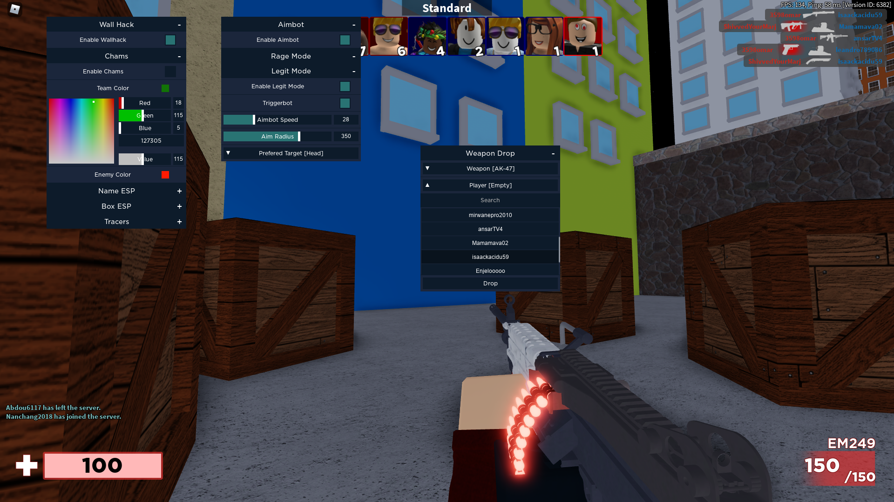

# DropLib Revamped v1
DropLib Revamped is a simple, efficient and beautiful way to quickly build a GUI for your scripts.
It features: All the UI elements you would ever want, super-easy to use yet versatile API, jawdropping defaults, nice and clean animations, In-Game gui updates!!, and much more!



## How to get started
1. Read the [Examplecode](#examplecode)
2. Read the [Documentation](#documentation)
3. See what you can [configure](#configuration)
4. ...
5. That should be enough

## Documentation
### Initialize
It is recommended that you keep a local copy of the script, so updates don't break anything and load times are fast
```lua
local gui = loadstring(game:HttpGet("https://raw.githubusercontent.com/TheLuaCoderDude/DropLibRevamped/refs/heads/main/drop-minified.lua"))():Init(CONFIG,SCREENGUI_PARENT)

--Or if you use DropLib.rbxm
local gui = require(pathToFolder.DropLib):Init(CONFIG,SCREENGUI_PARENT)
```
|CONFIG|SCREENGUI_PARENT|
|--|--|
|(Table)[User-config](#Configuration) which overwrites the default config, default: empty table|(Instance)parent for the screengui, default: game.Player.LocalPlayer.PlayerGui|

### Gui Methods
```lua
gui:CleanUp()
```
Removes everything

```lua
gui:RecursiveUpdateGui()
```
Updates the gui based on the values in gui.Config

### Create Category / Section / SubSection
```lua
local category = gui:CreateCategory(TITLE, POSITION)
local section = category:CreateSection(TITLE)
local subsection = section:CreateSection(TITLE)
```
You can have as many nested sections as you want

|TITLE|POSITION|
|--|--|
|(String)Title|(UDim2)Initial position on screen, default: auto align|

### Category Methods
```lua
category:MoveTo(POSITION)
```
|POSITION|
|--|
|(UDim2) Screen Position|

```lua
category:EnableDraggability()
category:DisableDraggability()
```

### Category & Section Methods
```lua
catOrSec:HideCollapseButton()
catOrSec:ShowCollapseButton()

catOrSec:Collapse()
catOrSec:Expand()
```

### Elements
All of these can be used with a category, (sub-)section

#### Get and Set easily
You don't have to specify a callback function if you don't want to, you can get the value of the element with:
```lua
element:GetValue()
--element could be a switch, colorpicker, etc.
```
You can also set the value with
```lua
element:SetValue(VALUE)
```

#### Button
```lua
local button = catOrSec:CreateButton(TITLE, CALLBACK)
```
|TITLE|CALLBACK|
|--|--|
|(String)Title|(Function)Function called on click|

#### Slider
```lua
local slider = catOrSec:CreateSlider(TITLE, CALLBACK, MIN, MAX, STEP, DYNAMIC, INITIAL)
```
|TITLE|CALLBACK|MIN|MAX|STEP|DYNAMIC|INITIAL|
|--|--|-|--|--|--|--|
|(String)Title|(Function)Function called on change|(Number)Minimum|(Number)Maximum|(Number)Step, default: 0.01|(Boolean)Whether callback is called while user slides, default: false|(Number)Initial value, default: MIN|

#### Switch
```lua
local switch = catOrSec:CreateSwitch(TITLE, CALLBACK, INITIAL)
```
|TITLE|CALLBACK|INITIAL|
|--|--|--|
|(String)Title|(Function)Function called on toggle|(Boolean)Initial state, default: false|

#### Color Picker
```lua
local colorPicker = catOrSec:CreateColorPicker(TITLE, CALLBACK, DYNAMIC, INITIAL)
```
|TITLE|CALLBACK|DYNAMIC|INITIAL|
|--|--|--|--|
|(String)Title|(Function)Function called on toggle|(Boolean)Whether callback is called while color is being picked.|(Color3)Initial color, default: Config.AccentColor|

#### Selector / Dropdown Menu
```lua
local selector = catOrSec:CreateSelector(TITLE, CALLBACK, GETCALL, INITIAL)
```
|TITLE|CALLBACK|GETCALL|INITIAL|
|--|--|--|--|
|(String)Title|(Function)Function called on toggle|(Function)Function that returns a Table from which a element is picked |(Any)Initial , default: nil / empty|

E.g. if you want to list all players, your getcall would be ``` function() return game.Players:GetPlayers() end ```

#### Text Label
```lua
local label = catOrSec:CreateTextLabel(TITLE)
```
|TITLE|
|--|
|(String)Title|

#### Key Detector
```lua
local detector = catOrSec:CreateKeyDetector(TITLE, CALLBACK, INITIAL)
```
|TITLE|CALLBACK|INITIAL|
|--|--|--|
|(String)Title|(Function)Function called on change|(KeyCode)Initial, default: Enum.KeyCode.Unknown|

#### Textbox
```lua
local textbox = catOrSec:CreateTextBox(TITLE, CALLBACK, ACCEPTFORMAT, DYNAMIC, INITIAL)
```
|TITLE|CALLBACK|ACCEPTFORMAT|DYNAMIC|INITIAL|
|--|--|--|--|--|
|(String)Title|(Function)Function called on change|(Pattern)Text has to match this pattern, default: ".+"/Accepts everything|(Boolean)Whether callback is called while user is typing|(String)Initial, default: ""/Empty text|

The AcceptFormat for a number only textbox would be: ```^d+$```

## Configuration
Default configuration (Under Development, alot is gonna change in the near future. Expect to redo your config), change anything to your liking:
```lua
Config.PrimaryColor = Color3.fromRGB(27, 38, 59)
Config.SecondaryColor = Color3.fromRGB(13, 27, 42)
Config.AccentColor = Color3.fromRGB(41, 115, 115)
Config.TextColor =  Color3.new(1,1,1)
Config.Font = Enum.Font.Gotham
Config.TextSize = 13
Config.HeaderWidth = 300
Config.HeaderHeight = 32
Config.EntryMargin = 1
Config.AnimationDuration = 0.4
Config.AnimationEasingStyle = Enum.EasingStyle.Quint
Config.DefaultEntryHeight = 35
```
The configurations are held in gui.Config. When changes are made, make sure to call gui:UpdateGui()

## Examplecode
```lua

local CONFIG = {
    PrimaryColor = Color3.fromRGB(27, 38, 59),
    SecondaryColor = Color3.fromRGB(13, 27, 42),
    AccentColor = Color3.fromRGB(41, 115, 115),
    TextColor = Color3.new(1, 1, 1),
    Font = Enum.Font.Gotham,
    TextSize = 13,
    HeaderWidth = 300,
    HeaderHeight = 32,
    EntryMargin = 1,
    AnimationDuration = 0.4,
    AnimationEasingStyle = Enum.EasingStyle.Quint,
    DefaultEntryHeight = 35,
}

local SCREENGUI_PARENT = game.Players.LocalPlayer:WaitForChild("PlayerGui")

local gui = loadstring(game:HttpGet("https://gitlab.com/0x45.xyz/droplib/-/raw/master/drop-minified.lua"))():Init(CONFIG, SCREENGUI_PARENT)

local category = gui:CreateCategory("Example Category", UDim2.new(0.5, -150, 0.5, -100))
local othercategory = gui:CreateCategory("Other Category", UDim2.new(0.5, -150, 0.5, -50))

local section = category:CreateSection("Main Section")
local othersection = category:CreateSection("Other Section")
local othersection2 = othercategory:CreateSection("Other Section 2")

local button = section:CreateButton("Click Me", function()
    print("Button clicked!")
end)

local slider = section:CreateSlider("Volume", function(value)
    print("Volume set to:", value)
end, 0, 100, 1, true, 50)

local switch = section:CreateSwitch("Toggle Feature", function(state)
    print("Feature enabled:", state)
end, false)

local colorPicker = section:CreateColorPicker("Pick a Color", function(color)
    print("Color selected:", color)
end, true, Color3.new(1, 0, 0))

local selector = section:CreateSelector("Select Player", function(selected)
    print("Player selected:", selected.Name)
end, function()
    return game.Players:GetPlayers()
end, nil)

local label = othersection2:CreateTextLabel("Status: Ready")

local keyDetector = othersection2:CreateKeyDetector("Press E", function(key)
    print("Key detected:", key)
end, Enum.KeyCode.E)

local textbox = section:CreateTextBox("Enter your name", function(text)
    print("Name entered:", text)
end, ".+", false, "")

gui:RecursiveUpdateGui()

local DestroyMenu = othersection:CreateButton("Destroy Menu",function() gui:CleanUp() end)

```
Super simple script with no functionality.

## Building
Although possible, the build system is rather hackish as of right now, so just use the minified version for all your needs.
(Build is done through the plugin Compile.rbxmx and Rojo, where DropLib.lua is selected and the button in the plugin menu is clicked. A merged and minified version should be in workspace)
